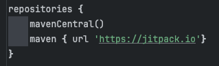
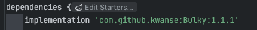
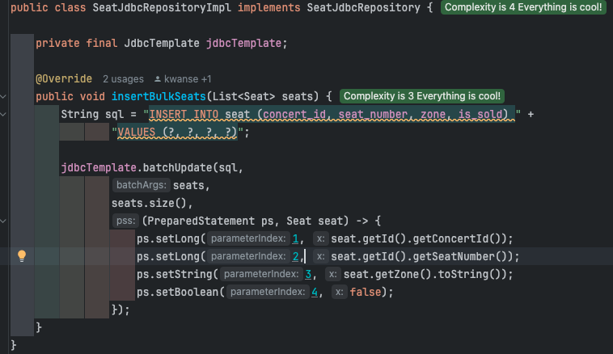
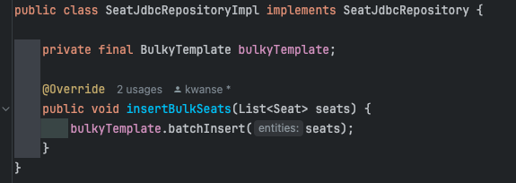

# Bulky - Bulk Insert 자동화 라이브러리

## 소개
> 메서드 하나만 사용하여 JdbcTemplate 기반 동적 Bulk Insert 실행

매번 작성해야 하는 JdbcTemplate 기반의 Bulk Insert 코드를 작성하는데 피로감을 느껴 개발하였습니다

## 사용법
``bulkyTemplate.batchInsert(articles);``

### 라이브러리 설정 방법

-> 최신 버전 사용을 권장 (현재 1.1.3)

### 라이브러리 적용 예시

**기존 코드**

 

**Bulky 라이브러리 적용 후 코드**

(Seat 는 복합 PK 를 가진 엔티티)

## 기능
1. 쿼리 작성
2. ``jdbcTemplate.batchUpdate()``실행
3. camelCase 를 snake_case 로 변경
4. 지정한 컬럼명 기반 쿼리 작성 `@Column(name = )`, `@JoinColumn(name = )`
5. `@Embedded` 지원
6. `@JoinColumn` 지원
7. `@EmbeddedId` 지원

## 지원하지 않는 기능
1. ``@Enumerated(EnumType.ORDINAL)``
2. ``@ManyToOne`` 관계인 엔티티가 복합 PK 를 가지는 경우
3. ``@ElementCollection``

## 기존 대비 성능
